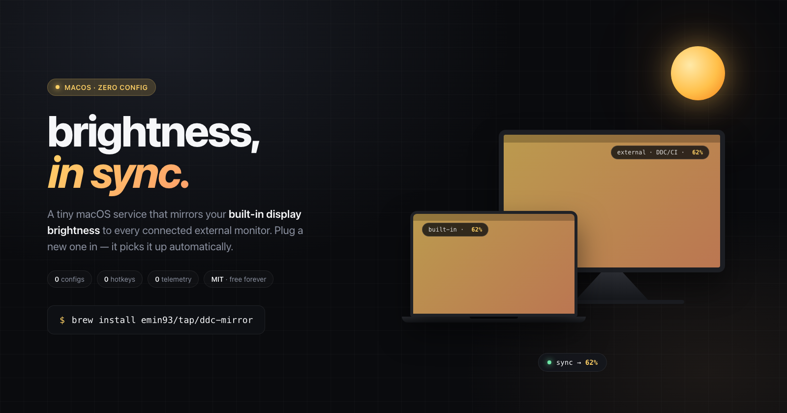

<div align="center">

# ✨ ddc-mirror

### 🔆 Your external displays, finally in sync with macOS brightness.



[](LICENSE)
[](#)
[](#)

[**🌐 ddc-mirror.emin.ch**](https://ddc-mirror.emin.ch) &nbsp;·&nbsp; [**📦 GitHub**](https://github.com/emin93/ddc-mirror)

</div>

---

## 🪄 What is it?

A tiny macOS LaunchAgent that watches your **built-in display's brightness** and mirrors it to **every external monitor** you have plugged in.

When macOS dims your MacBook (manually, or automatically via the ambient light sensor), `ddc-mirror` syncs the same brightness to all your externals. It picks the best mechanism per display automatically: Apple's native API for Studio/Pro Display XDR, DDC/CI for monitors on a direct cable, and profile-aware software dimming for monitors behind docks or hubs that strip DDC.

## 🚀 Install &amp; forget

```sh
brew install emin93/tap/ddc-mirror
brew services start ddc-mirror
```

That's it. There is no step two.

### Optional calibration

If an external monitor looks consistently darker or brighter than the MacBook
display, add a small offset for external displays:

```sh
defaults write ch.emin.ddc-mirror externalBrightnessOffset -float 0.10
brew services restart ddc-mirror
```

`0.10` means +10 brightness points, so MacBook 50% maps to external 60%.
Negative values work too, and the final brightness is always clamped between 0%
and 100%.

## 💡 Why you'll like it

- 🔌 **Plug-and-sync.** Connect a new monitor and it gets picked up on the next tick. Unplug one and it's gone. No restart, no config.
- 🖥️ **Every monitor, every time.** Multiple externals? They all sync. No "primary display" weirdness.
- 🤫 **Invisible.** No menu bar icon. No preferences pane. No hotkeys to remember. The only UI is the one Apple already ships.
- 🧘 **Lightweight.** ~55 KB binary, ~10 MB resident memory. You will not notice it is running.
- 🕵️ **No telemetry.** No analytics, no update pings, no crash reports phoned home. It physically cannot tell anyone you installed it.
- 💸 **Free forever.** MIT licensed. No pro tier, no paywall, no "upgrade for more features." There are no more features &mdash; that's the whole point.

## 🧠 How it works

### 👂 &nbsp;1. Listen, don't poll

Subscribes to Apple's private `DisplayServices` brightness-change push notification &mdash; the same signal that drives the macOS brightness HUD. Zero polling, zero wakeups when nothing's changing.

### 🎯 &nbsp;2. Pick the right path per display

On startup, each external monitor is probed once and routed to the best available mechanism:

- 🍎 &nbsp;**Apple-native API** &mdash; for Studio Display &amp; Pro Display XDR.
- 🔌 &nbsp;**DDC/CI** &mdash; `IOAVServiceWriteI2C` VCP `0x10`, for monitors on a direct cable (Apple Silicon).
- 🌗 &nbsp;**Profile-aware software dimming** &mdash; captures each display's existing ColorSync transfer table, then scales that table with `CGSetDisplayTransferByTable` when hardware brightness is unavailable.

Each brightness change is debounced (~80 ms) and fanned out to every display.

### 🔁 &nbsp;3. Stay in sync, always

Re-enumerates displays on hot-plug (`CGDisplayRegisterReconfigurationCallback`) and on wake (`IORegisterForSystemPower`). Restores ColorSync settings on exit. Survives reboots via `brew services`.

## 🛠️ Development

```sh
make
./ddc-mirror
```

The whole thing is one `.m` file and a Makefile. No SwiftPM, no dependencies. Builds on Apple Silicon and Intel; on Intel, the DDC code path compiles out and every external falls back to profile-aware software dimming.

## 📜 License

[MIT](LICENSE) &middot; made with 💛 by [emin](https://emin.ch)
